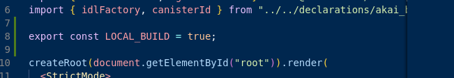

# AKAI SPACE

Contains the necessary documentation for seamless audits and bug fixing

## If developing locally set the const LOCAL_BUILD as true (app.jsx)


## Task Settlement Logic


## ic-sqlite-features

`ic-sqlite-features` is our custom fork of `ic-sqlite`, designed to re-export all `rusqlite` components without any dependency conflicts and to include additional standalone features, such as database backup streaming. This fork is specifically optimized to work within ICP WASM Environment by leveraging VFS.

To integrate `ic-sqlite-features` into your project, you can use Cargo with the following command:

```bash
cargo add ic-sqlite-features
```

Project Link: https://github.com/JoeruCodes/ic-sqlite

## ic-rand

`ic-rand` is a custom random number generator designed for use within the ICP WASM environment. This implementation is based on the Linear Congruential Generator (LCG) algorithm and supports configurable parameters to suit various use cases. The crate is optimized for deterministic random number generation, ensuring compatibility with both standard and constrained environments like Internet Computer (ICP).

It provides flexible support for different integer types through Rust generics, making it adaptable for various applications requiring randomness in distributed systems. This crate ensures minimal dependency conflicts while maintaining full compatibility with the `icp` ecosystem.

To integrate `ic-rand` into your project, you can use Cargo with the following command:

```bash
cargo add ic-rand
```

Project Link: https://github.com/JoeruCodes/ic-rand

# Generating candids

Run `generate.sh` to generate candids for frontend definitions.

- Start by installing `candid-extractor` with `cargo install candid-extractor`.
- Then, make the script executable using `chmod +x generate.sh`
- Execute it with `./generate.sh`

# Backup System

To utilize the backup system, follow these steps:

- Create a C# file in your project.
- Add the following code for the Azure Function:

```
using System.IO;
using System.Text.Json;
using Microsoft.AspNetCore.Mvc;
using Microsoft.Azure.WebJobs;
using Microsoft.Azure.WebJobs.Extensions.Http;
using Microsoft.AspNetCore.Http;
using Microsoft.Extensions.Logging;
using Azure.Storage.Blobs;

public static async Task<IActionResult> Run(
    [HttpTrigger(AuthorizationLevel.Function, "post", Route = null)] HttpRequest req,
    ILogger log)
{
    log.LogInformation("C# HTTP trigger function processed a request.");

    // Read and deserialize the request body
    string requestBody = await new StreamReader(req.Body).ReadToEndAsync();
    var data = JsonSerializer.Deserialize<RequestData>(requestBody);

    // Extract information from the request
    var account = data.Account;
    var accessKey = data.AccessKey;
    var container = data.Container;
    var blobName = data.BlobName;
    var fileContent = data.FileContent;

    // Initialize the Blob Service Client
    var blobServiceClient = new BlobServiceClient(new Uri($"https://{account}.blob.core.windows.net"), new StorageSharedKeyCredential(account, accessKey));
    var blobContainerClient = blobServiceClient.GetBlobContainerClient(container);
    var blobClient = blobContainerClient.GetBlobClient(blobName);

    // Upload the file content to Blob Storage
    using (var stream = new MemoryStream(System.Convert.FromBase64String(fileContent)))
    {
        await blobClient.UploadAsync(stream, true);
    }

    return new OkObjectResult("File uploaded successfully.");
}

public class RequestData
{
    public string Account { get; set; }
    public string AccessKey { get; set; }
    public string Container { get; set; }
    public string BlobName { get; set; }
    public string FileContent { get; set; }
}

```

# Backup System Chunked Stream

To utilize the chunked streamed backup system, follow these steps:

- Create a C# file in your project.
- Add the following code for the Azure Function:

```
public static async Task<IActionResult> Run(
    [HttpTrigger(AuthorizationLevel.Function, "post", Route = null)] HttpRequest req,
    ILogger log)
{
    log.LogInformation("C# HTTP trigger function processed a request.");

    string account = req.Query["account"];
    string accessKey = req.Query["accessKey"];
    string container = req.Query["container"];
    string blobName = req.Query["blobName"];
    string partNumber = req.Query["partNumber"];

    string fileContent = await new StreamReader(req.Body).ReadToEndAsync();
    byte[] data = Convert.FromBase64String(fileContent);

    var blobServiceClient = new BlobServiceClient(new Uri($"https://{account}.blob.core.windows.net"), new StorageSharedKeyCredential(account, accessKey));
    var blobContainerClient = blobServiceClient.GetBlobContainerClient(container);
    var blobClient = blobContainerClient.GetBlobClient(blobName);

    using (var stream = new MemoryStream(data))
    {
        await blobClient.UploadAsync(stream, overwrite: true);
    }

    return new OkObjectResult($"File uploaded successfully. Part: {partNumber}");
}
```

# NOTE

If `dfx deploy --playground` is failing because `assetstorage.did` cannot be found, follow this workaround:

Create the file `.dfx/local/canisters/akai_frontend/assetstorage.did` with the following content:

```
type BatchId = nat;
type ChunkId = nat;
type Key = text;
type Time = int;

type CreateAssetArguments = record {
key : Key;
content_type : text;
max_age : opt nat64;
headers : opt vec HeaderField;
enable_aliasing : opt bool;
allow_raw_access : opt bool;
};

// Add or change content for an asset, by content encoding
type SetAssetContentArguments = record {
key : Key;
content_encoding : text;
chunk_ids : vec ChunkId;
sha256 : opt blob;
};

// Remove content for an asset, by content encoding
type UnsetAssetContentArguments = record {
key : Key;
content_encoding : text;
};

// Delete an asset
type DeleteAssetArguments = record {
key : Key;
};

// Reset everything
type ClearArguments = record {};

type BatchOperationKind = variant {
CreateAsset : CreateAssetArguments;
SetAssetContent : SetAssetContentArguments;

SetAssetProperties : SetAssetPropertiesArguments;

UnsetAssetContent : UnsetAssetContentArguments;
DeleteAsset : DeleteAssetArguments;

Clear : ClearArguments;
};

type CommitBatchArguments = record {
batch_id : BatchId;
operations : vec BatchOperationKind;
};

type CommitProposedBatchArguments = record {
batch_id : BatchId;
evidence : blob;
};

type ComputeEvidenceArguments = record {
batch_id : BatchId;
max_iterations : opt nat16;
};

type DeleteBatchArguments = record {
batch_id : BatchId;
};

type HeaderField = record { text; text };

type HttpRequest = record {
method : text;
url : text;
headers : vec HeaderField;
body : blob;
certificate_version : opt nat16;
};

type HttpResponse = record {
status_code : nat16;
headers : vec HeaderField;
body : blob;
streaming_strategy : opt StreamingStrategy;
};

type StreamingCallbackHttpResponse = record {
body : blob;
token : opt StreamingCallbackToken;
};

type StreamingCallbackToken = record {
key : Key;
content_encoding : text;
index : nat;
sha256 : opt blob;
};

type StreamingStrategy = variant {
Callback : record {
  callback : func(StreamingCallbackToken) -> (opt StreamingCallbackHttpResponse) query;
  token : StreamingCallbackToken;
};
};

type SetAssetPropertiesArguments = record {
key : Key;
max_age : opt opt nat64;
headers : opt opt vec HeaderField;
allow_raw_access : opt opt bool;
is_aliased : opt opt bool;
};

type ConfigurationResponse = record {
max_batches : opt nat64;
max_chunks : opt nat64;
max_bytes : opt nat64;
};

type ConfigureArguments = record {
max_batches : opt opt nat64;
max_chunks : opt opt nat64;
max_bytes : opt opt nat64;
};

type Permission = variant {
Commit;
ManagePermissions;
Prepare;
};

type GrantPermission = record {
to_principal : principal;
permission : Permission;
};
type RevokePermission = record {
of_principal : principal;
permission : Permission;
};
type ListPermitted = record { permission : Permission };

type ValidationResult = variant { Ok : text; Err : text };

type AssetCanisterArgs = variant {
Init : InitArgs;
Upgrade : UpgradeArgs;
};

type InitArgs = record {};

type UpgradeArgs = record {
set_permissions : opt SetPermissions;
};

/// Sets the list of principals granted each permission.
type SetPermissions = record {
prepare : vec principal;
commit : vec principal;
manage_permissions : vec principal;
};

service : (asset_canister_args : opt AssetCanisterArgs) -> {
api_version : () -> (nat16) query;

get : (
  record {
    key : Key;
    accept_encodings : vec text;
  },
) -> (
  record {
    content : blob; // may be the entirety of the content, or just chunk index 0
    content_type : text;
    content_encoding : text;
    sha256 : opt blob; // sha256 of entire asset encoding, calculated by dfx and passed in SetAssetContentArguments
    total_length : nat; // all chunks except last have size == content.size()
  },
) query;

// if get() returned chunks > 1, call this to retrieve them.
// chunks may or may not be split up at the same boundaries as presented to create_chunk().
get_chunk : (
  record {
    key : Key;
    content_encoding : text;
    index : nat;
    sha256 : opt blob; // sha256 of entire asset encoding, calculated by dfx and passed in SetAssetContentArguments
  },
) -> (record { content : blob }) query;

list : (record {}) -> (
  vec record {
    key : Key;
    content_type : text;
    encodings : vec record {
      content_encoding : text;
      sha256 : opt blob; // sha256 of entire asset encoding, calculated by dfx and passed in SetAssetContentArguments
      length : nat; // Size of this encoding's blob. Calculated when uploading assets.
      modified : Time;
    };
  },
) query;

certified_tree : (record {}) -> (
  record {
    certificate : blob;
    tree : blob;
  },
) query;

create_batch : (record {}) -> (record { batch_id : BatchId });

create_chunk : (record { batch_id : BatchId; content : blob }) -> (record { chunk_id : ChunkId });

// Perform all operations successfully, or reject
commit_batch : (CommitBatchArguments) -> ();

// Save the batch operations for later commit
propose_commit_batch : (CommitBatchArguments) -> ();

// Given a batch already proposed, perform all operations successfully, or reject
commit_proposed_batch : (CommitProposedBatchArguments) -> ();

// Compute a hash over the CommitBatchArguments.  Call until it returns Some(evidence).
compute_evidence : (ComputeEvidenceArguments) -> (opt blob);

// Delete a batch that has been created, or proposed for commit, but not yet committed
delete_batch : (DeleteBatchArguments) -> ();

create_asset : (CreateAssetArguments) -> ();
set_asset_content : (SetAssetContentArguments) -> ();
unset_asset_content : (UnsetAssetContentArguments) -> ();

delete_asset : (DeleteAssetArguments) -> ();

clear : (ClearArguments) -> ();

// Single call to create an asset with content for a single content encoding that
// fits within the message ingress limit.
store : (
  record {
    key : Key;
    content_type : text;
    content_encoding : text;
    content : blob;
    sha256 : opt blob;
  },
) -> ();

http_request : (request : HttpRequest) -> (HttpResponse) query;
http_request_streaming_callback : (token : StreamingCallbackToken) -> (opt StreamingCallbackHttpResponse) query;

authorize : (principal) -> ();
deauthorize : (principal) -> ();
list_authorized : () -> (vec principal);
grant_permission : (GrantPermission) -> ();
revoke_permission : (RevokePermission) -> ();
list_permitted : (ListPermitted) -> (vec principal);
take_ownership : () -> ();

get_asset_properties : (key : Key) -> (
  record {
    max_age : opt nat64;
    headers : opt vec HeaderField;
    allow_raw_access : opt bool;
    is_aliased : opt bool;
  },
) query;
set_asset_properties : (SetAssetPropertiesArguments) -> ();

get_configuration : () -> (ConfigurationResponse);
configure : (ConfigureArguments) -> ();

validate_grant_permission : (GrantPermission) -> (ValidationResult);
validate_revoke_permission : (RevokePermission) -> (ValidationResult);
validate_take_ownership : () -> (ValidationResult);
validate_commit_proposed_batch : (CommitProposedBatchArguments) -> (ValidationResult);
validate_configure : (ConfigureArguments) -> (ValidationResult);
};
```
